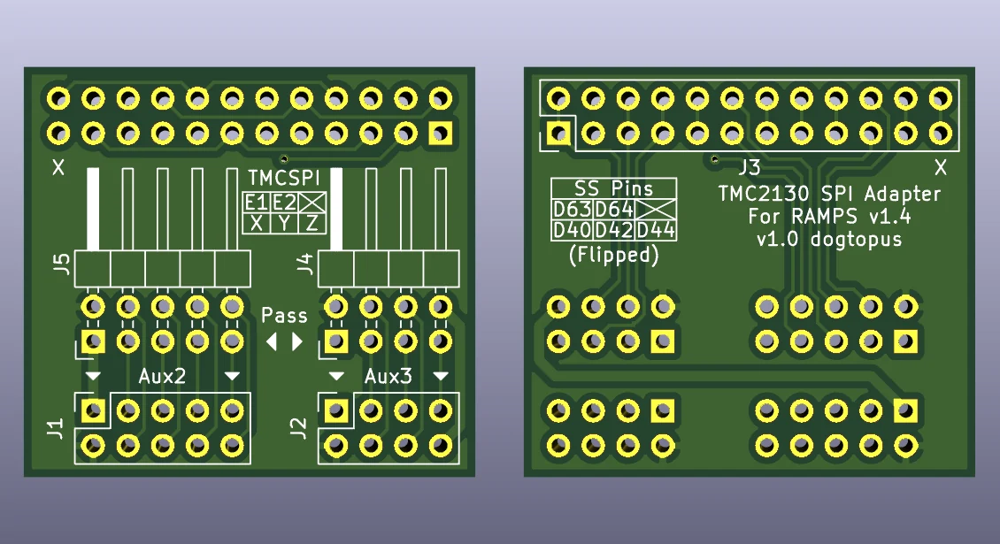

# RAMPS SSS

TMC2130 (SilentStepStick) SPI Adapter for RAMPS v1.4

## Features

- Dedicated 4-pin connector for each TMC2130 unit. Works with either .1" cable assemblies or individual jumper wires.
- Intuitive pinouts.
- Passthrough connectors for both Aux2 and Aux3 enable access to unused pins. Can co-exist with SPI SD card reader.

## BOM

J1, J2: **Angled** double row female .1" header.
J3: Straight double row male .1" header (can also use 5x 4-position colored single row headers for better pin differentiation)
J4, J5: Angled double row male .1" header.

## SS pin allocations

| SS | Axis | RAMPS Pin | 
| --- | --- | --- |
| 0 | X | D40 |
| 1 | Y | D42 |
| 2 | Z | D44 |
| 3 | E0 | D63/A9 |
| 4 | E1 | D64/A10 |
